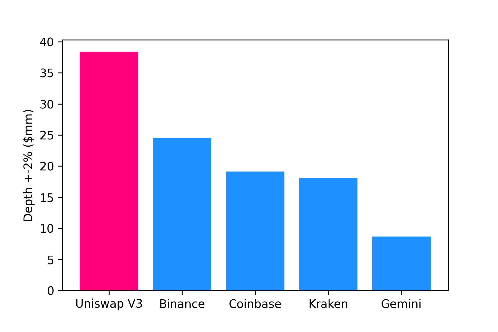
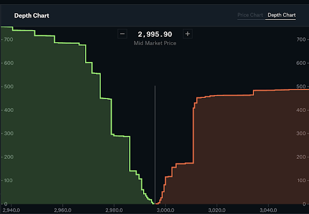
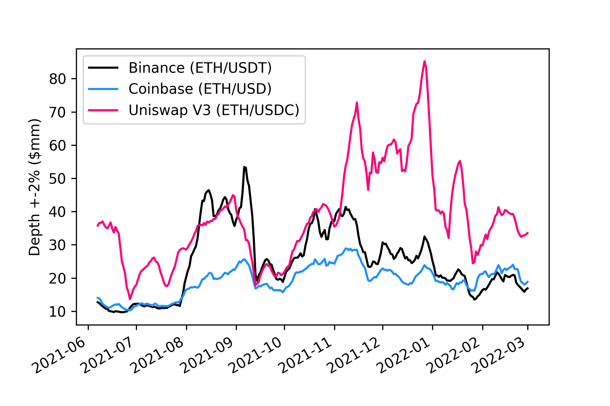
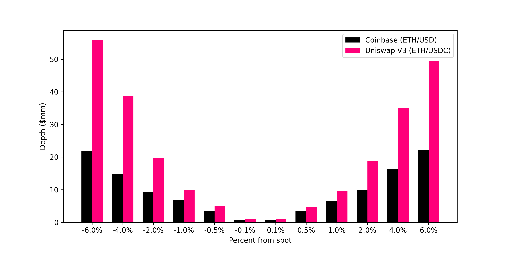
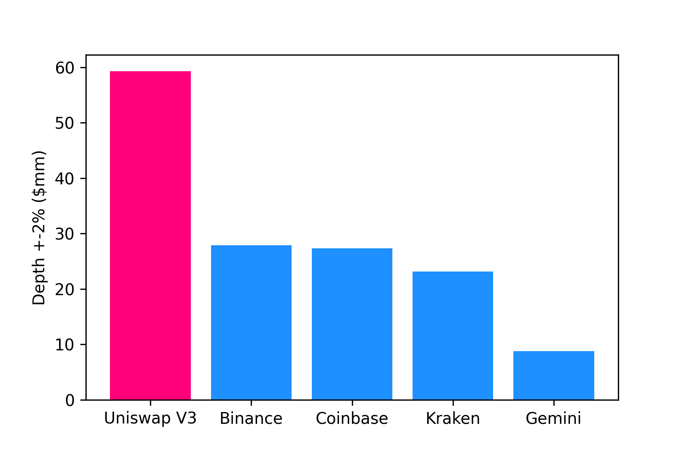
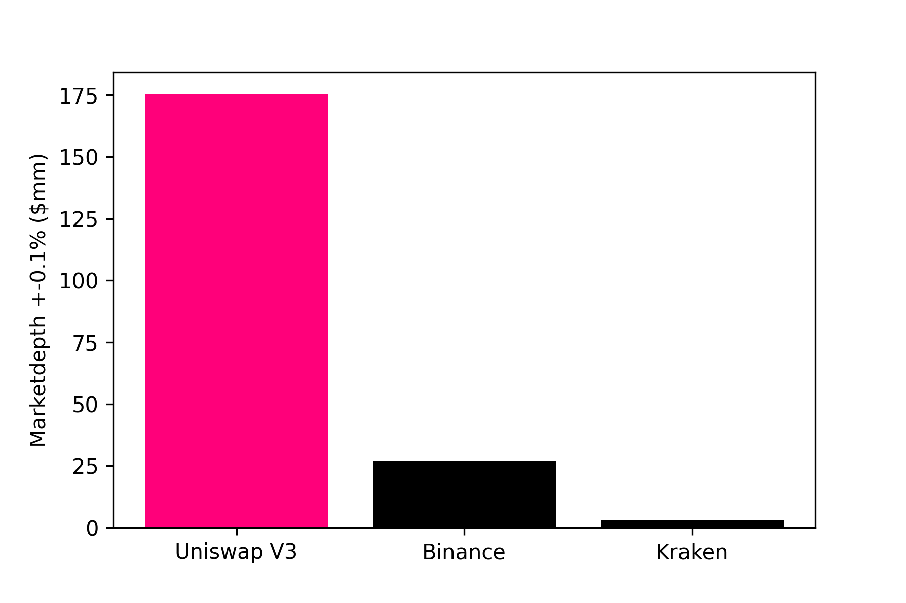
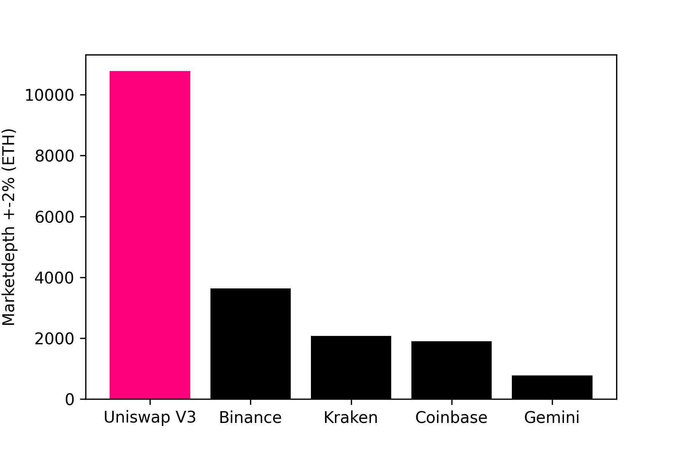

#     **The unfathomable depth of Uniswap v3**

Gordon Liao and Dan Robinson[^1]

Automated Market Makers (AMMs) have emerged as an important form of liquidity provision for digital assets. The typical explanation for why some market participants have opted to use AMMs over centralized exchanges is that AMMs enable composability with other decentralized financial (DeFi) protocols and provide trading without asset custody by intermediaries. One less examined, but perhaps more important reason for why AMMs might dominate in the future of trading for both digital and non-digital-native assets is that AMMs can deliver _higher liquidity_ than centralized exchanges. This is because the decentralized AMM design reduces technical barriers to market making and opens the floodgates to let in an ocean of previously unused capital.

We compare the liquidity on Uniswap V3 ([white paper](https://uniswap.org/whitepaper-v3.pdf)), the most popular AMM, with that of centralized exchanges, across a set of large-cap digital asset pairs. We find that Uniswap V3 consistently has substantially higher liquidity, as measured by market depth, compared to the largest centralized exchanges in spot markets.

Figure 1 illustrates our main finding. Compared to several large centralized exchanges, Uniswap V3 has around 2x greater market depth on average for spot ETH-dollar pairs (using the most liquid dollar or stablecoin on each platform for comparison). Uniswap V3 compares even more favorably by aggregating risk across all ETH-dollar pairs, as shown in Appendix Figure A1.

**Figure 1.** Market depth comparison for ETH/USD stables

_Note: The plot shows the daily average +/- 2% spot market depth in $millions for the sample period from June 1, 2021 to March 1st, 2022. The comparison uses the most liquid ETH/USD pair for each of these markets (ETH/USDC on Uniswap v3 Layer 1, ETH/USDT on Binance, ETH/USD on Coinbase, and ETH/USD on Gemini). The market depth data for centralized exchanges is provided by Kaiko._

Beyond ETH/USD pairs, Uniswap V3 also has greater market depth for ETH-based mid-cap token pairs as well as stablecoin-to-stablecoin pairs.

## **Measuring liquidity via market depth**

Market depth is a common measure of liquidity for assets traded on exchanges. At its core, market depth indicates how much of one asset can be traded for another asset at a given price level. High market depth is needed to support high transaction volumes with reliable execution.

Market depth in traditional limit order books can be calculated by adding up the amount of limit order at each price level. For instance, Coinbase provides market depth charts for its pro-account users as shown in Figure 2.

**Figure 2. Market depth chart on Coinbase Pro**

In AMMs, there are no limit order books. Instead, liquidity providers (LPs) deposit a pair of assets into a common pool that can be traded against by liquidity demanders (traders). In exchange for their capital and the risk they take on due to potential adverse selection, liquidity providers earn a fee on every trade. LPs can post assets into a liquidity pool either in a customizable range of prices (Uniswap V3) or in the full price range (Uniswap V2). The distribution of liquidity over a price range provides the signature necessary to derive an equivalent market depth similar to that of limit order books.

We provide a methodology for calculating market depth on Uniswap V3 (see appendix below) and implement the calculation across pools and fee tiers. We’ve made both our [code](https://github.com/Uniswap/v3-market-depth-study) and [data](https://bit.ly/v3depthdata) freely available.[^2]

## **Comparison of V3 versus centralized exchanges**

Overall, Uniswap v3 has had significantly higher market depth throughout the past several months than centralized exchanges in spot trading. This higher liquidity is observed on both large-cap pairs such as ETH/USDC (relative to equivalent pairs on centralized exchanges) and mid- to small-cap pairs. Figure 3 below shows the time series of ETH-dollar pairs across Uniswap V3, Binance, and Coinbase.

**Figure 3.** Market depth comparison for Uniswap V3 (ETH/USDC), Binance (ETH/USDT), and Coinbase (ETH/USD)

_Note: The time series is of 7-day rolling mean of +/- 2% spot market depth in $millions. Market depth on Uniswap V3 is from Layer 1 only. The market depth data for centralized exchanges is provided by Kaiko._

Similar to ETH/dollar pairs, Uniswap V3 also has higher average market depth on mid-cap and cross-chain pairs (Table 1) as well as stablecoin-to-stablecoin pairs (Appendix Figure A2).

**Table 1.** Market depth comparison for ETH-pairs

<table>
  <tr>
   <td><strong>Pairs</strong>
   </td>
   <td><strong>Uniswap V3</strong>
   </td>
   <td><strong>Binance</strong>
   </td>
   <td><strong>Kraken</strong>
   </td>
   <td><strong>Coinbase</strong>
   </td>
  </tr>
  <tr>
   <td>MATIC/ETH
   </td>
   <td><strong>295</strong>
   </td>
   <td>66
   </td>
   <td>-
   </td>
   <td>-
   </td>
  </tr>
  <tr>
   <td>COMP/ETH
   </td>
   <td><strong>46</strong>
   </td>
   <td>-
   </td>
   <td>20
   </td>
   <td>-
   </td>
  </tr>
  <tr>
   <td>YFI/ETH
   </td>
   <td><strong>113</strong>
   </td>
   <td>-
   </td>
   <td>37
   </td>
   <td>-
   </td>
  </tr>
  <tr>
   <td>LINK/ETH
   </td>
   <td><strong>227</strong>
   </td>
   <td>88
   </td>
   <td>158
   </td>
   <td>93
   </td>
  </tr>
  <tr>
   <td>(W)BTC/ETH
   </td>
   <td><strong>10776</strong>
   </td>
   <td>3640
   </td>
   <td>2076
   </td>
   <td>1895
   </td>
  </tr>
</table>

_Note: The table shows +/- 2% average spot market depth in ETH for the sample period 02/28/22-03/28/22. Market depth on Uniswap V3 is from Layer 1 only. The market depth data for centralized exchanges is provided by Kaiko._

Additionally, higher market depth on Uniswap v3 is observed across all price levels, as seen in Figure 4. The liquidity advantage for Uniswap v3 grows with the expected price impact. This means that for larger trades, it is even more advantageous to execute on Uniswap V3 relative to centralized exchanges.

**Figure 4.** Market depth comparison for Uniswap v3 ETH/USDC vs Coinbase ETH/USD

_Note: The plot shows the average spot market depth in $millions for the sample period from June 1, 2021 to March 1st, 2022 across price levels. Market depth on Uniswap V3 is from Layer 1 only. The market depth data for centralized exchanges is provided by Kaiko._

The above analysis does not take into account transaction costs, including gas cost on Ethereum, fees on centralized or decentralized exchanges, or unexpected pre-trade slippage. These are potential topics for future research. Broadly speaking, these additional transaction fees are comparable for Uniswap V3 and centralized exchanges and are small relative to costs associated with market depths for large trade sizes.[^3]

The cost savings from executing on a more liquid market is direct. For a trade on the ETH/dollar pair that results in a 10 bps price impact on average in Coinbase Pro, the equivalent trade on Uniswap V3 would generate a 7.5 bps price impact on average, saving the trader 2.5 bps of the notional (~2 bps net of gas cost).[^4] The savings are even greater for larger trade sizes. For a trade size of $5mm, the savings would be around 1% _of the notional_ given the expected price impact difference.[^5]

## **Why are there deeper markets on-chain?**

The decentralized nature of AMMs and more passive liquidity provision opened up market making activities to a broader set of market participants. In traditional centralized exchanges, market making is dominated by high-frequency traders that compete in both the quality of the market making algo as well as execution speed, leading to an unnecessary arms race in trading technology and suboptimal market structure.[^6] Batched auctions instead of continuous limit order books could resolve some of the issues associated with the competition for speed, but market making would be still reserved for high frequency traders. Additionally, individual investors had not reap rewards from their liquidity provision through limit orders placed on traditional exchanges.[^7]

AMMs unlock a much larger set of more passive capital that was previously sitting on the sidelines. This is because general institutional and retail users have risk-and-return profiles that differ from those of specialized market makers on centralized exchanges. As a result, AMMs are able to attract more diverse capital sources to participate as market makers and hence deepen liquidity. In earlier versions of AMMs, e.g. Uniswap V2, passive liquidity providers can enter a market making position without any additional intervention. Uniswap V3 introduced concentrated liquidity that requires some rebalancing. Even with rebalancing needs, the vast majority of capital deployed for liquidity provision on V3 are relatively passive. Table 2 shows that around two-thirds of liquidity positions are held greater than one day.  Overall, the Uniswap protocol has attracted around 130,000 unique liquidity providers.[^8]

**Table 2.** Duration of Uniswap V3 Liquidity Provider Positions

<table>
  <tr>
   <td><strong>Duration of LP positions</strong>
   </td>
   <td><strong>Percent of LPs</strong>
   </td>
  </tr>
  <tr>
   <td>&lt; 1 minute
   </td>
   <td>3 %
   </td>
  </tr>
  <tr>
   <td>&lt; 1 hour
   </td>
   <td>12 %
   </td>
  </tr>
  <tr>
   <td>&lt; 1 day
   </td>
   <td>38 %
   </td>
  </tr>
  <tr>
   <td>1 day +
   </td>
   <td>68 %
   </td>
  </tr>
</table>

_Note: The duration of LP positions is the time period between the initial mint and first burn of a LP position._

## **Beyond Digital Assets**

Decentralized AMMs is an innovation in market structure with impact far beyond digital assets. The lack of liquidity in thinly traded assets has been a recognized challenge to central limit order exchanges. In particular, the Security and Exchange Commission had issued a solicitation for innovations to improve liquidity in thinly traded listed equities.[^9]	 This emphasis for innovation in market structure exists because liquidity challenges can be detrimental to both investors and issuers. For investors, the lack of liquidity not only increases transaction costs but also deters the willingness to invest in assets that might have high expected returns.[^10] For issuers, poor market liquidity can raise the cost of capital and increase chances of default.[^11][^12]

In a future with more tokenized assets, the Uniswap Protocol will not only supplement but also directly compete with traditional exchanges in trading a variety of assets, facilitating both deeper and more stable liquidity. The resultant increase in liquidity can improve the price discovery process for thinly traded assets and ultimately foster capital formation and economic growth.

## **Conclusion**

Uniswap V3, deployed less than a year ago, has gained dominance over traditional forms of central limit order books in providing a trading venue for deep liquidity in digital assets. As more passive and diverse capital sources are unlocked through decentralized AMMs, market liquidity and efficiency will likely deepen beyond traditional limit order books.

We will highlight other advantages over traditional forms of exchange and price discovery in future studies.

--------

## **Appendix A: Additional Figures**

**Figure A1:** Market depth comparison for ETH-dollar pairs (aggregating across pairs)

_Note:This figure compares the market depth for ETH/USD pairs aggregating across ETH/USD, ETH/USDC, ETH/USDT, and ETH/DAI. Data on centralized exchanges is provided by Kaiko. Sample period is from June 2021 to March 2022._

**Figure A2:** Market depth comparison for USDC/USDT

_Note:This figure compares the market depth for the USDC/USDT stablecoin pair on Uniswap v3, Binance, and Kraken. Data on centralized exchanges is provided by Kaiko. Sample period is from November 2021 to March 2022._

**Figure A3:** Market depth comparison for (W)BTC/ETH

_Note: This figure compares the market depth for the ETH/(W)BTC on Uniswap v3, Binance, and Kraken and Gemini. Data on centralized exchanges is provided by Kaiko. Sample period is from 02/28/22 to 03/28/22._

-----------

## Appendix B: Methodology
We describe the methodology for calculating market depth in Uniswap V2 (constant product AMM) and Uniswap V3 below.

Let $m(\delta)$ be market depth defined as the amount of asset $x$ that can be exchanged for asset $y$ for a given $\delta$ percent of price impact (e.g. $\delta=2\%)$. Let $p_0$ be the current spot price of asset $x$ in units of asset $y$, and $L$ be the liquidity amount locked in the pool. Market depth for Uniswap V2 expressed in units of asset $x$ is calculated as

$$
m(\delta)=\left|\frac{L}{\sqrt{\left(1+\delta\right)p_{0}}}-\frac{L}{\sqrt{p_0}}\right|.
$$

Market depth calculation in Uniswap V3 is more complicated as the liquidity distribution is an aggregation of individual liquidity provider positions.
Let $\lambda_{x}(i)$ be the amount of asset $x$ locked in the liquidity range between tick $i$ and $i+s$, where $s$ is the tick spacing for the pool. Let $\lambda_{y}(i)$ be the amount of asset $y$ in this tick range. It can be shown that for lower tick $i$ and associated lower bound prices $p_a$ and upper bound price $p_b$, assets $x$ and $y$ locked in the tick spacing are

$$
\lambda_{x}(i)=\frac{L}{\sqrt{z}}-\frac{L}{\sqrt{p_{b}}}
$$
and

$$
\lambda_{y}(i)=L\left(\sqrt{z}-\sqrt{p_{a}}\right)
$$

where $z=\begin{cases}
p_{a} & \forall p_0\le p_{a}\\
p_0 & \forall p_0\in\left(p_{a},p_{b}\right)\\
p_{b} & \forall p_0\ge p_{b}
\end{cases}.$

Market depth for Uniswap V3 expressed in units of asset $x$ is

$$m\left(\delta\right)=\frac{1}{s}\sum_{i=i_{0}}^{i_{0}+d(\delta)}\left|\lambda_x(i)+p_0^{-1}\lambda_y(i)\right|,$$

where $i_0$ is the current tick associated with $p_0$ and $d$ is the tick-equivalent of the percentage price change $\delta$.

**Derivation for V2 market depth**

Let $m(\delta)$ be market depth defined as the amount of asset $x$ that can be exchanged for asset $y$ for a given $\delta$ percent of price impact (e.g. $\delta=2\%)$
The bonding curve is described by $xy=L^{2}$.

Using the price relationship $p	=\frac{y}{x}$, we can also express the bonding curve as  $p	=\frac{L^{2}}{x^{2}}$,$p	=\frac{y^{2}}{L^{2}}$,$x	=\frac{L}{\sqrt{p}}$, or $y=L\sqrt{p}$.

After a trade of $\Delta x$ units of asset $x$ for $\Delta y$ units of asset $y$, the bonding curve is
$$
\left(x+\Delta x\right)(y+\Delta y)=L^{2}.
$$

We solve for $\Delta x$ s.t. $p_{1}/p_{0}-1=\delta$, substituting $p_0=y/x$ and $p_1=(y+\Delta y)/(x+\Delta x)$, the expression becomes
$$
\frac{y+\Delta y}{x+\Delta x}\frac{x}{y}-1=\delta.
$$
<!-- or
\begin{align*}
y+b=\left(\delta+1\right)p_{0}\left(x+a\right)
\end{align*}
 -->
Substitute into the post-trade equation, we get
$$
\left(x+\Delta x\right)^{2}\left(\delta+1\right)p_{0}=L^{2}.
$$
Market depth in units of asset $x$ is therefore
$$
m(\delta)\equiv |\Delta x|=
\left|\frac{L}{\sqrt{\left(1+\delta\right)p_{0}}}-\frac{L}{\sqrt{p_0}}\right|
$$

<!--
Alternatively, in terms of units of asset $y$, market depth is
$$b=L\sqrt{\left(\delta+1\right)p_{0}}-y=L\sqrt{\left(\delta+1\right)p_{0}}-L\sqrt{p_0},$$ and we can express market depth $m(\delta)$ in terms of units of $x$ by converting $b$ at the average price $$m(\delta)=b\frac{p_0+p_1}{2}=(L\sqrt{\left(\delta+1\right)p_{0}}-L\sqrt{p_0})\frac{p_0+p_1}{2},$$  -->

**Derivation for V3 market depth**

Let $j$ be an index for lower tick boundary and $s$ be the tick spacing (e.g. $s=60$). Let $p_0$ be the current price and $p_{a}$, $p_{b}$ be the prices associated with upper and lower ticks of a tick-space range. More explicity, $p_a=1.0001^j$ and $p_b=1.0001^{(j+s)}$.

Starting with real reserve curve of a single position, Equation 2.2 from v3 white paper:

$$
\left(x+\frac{L}{\sqrt{p_{b}}}\right)\left(y+L\sqrt{p_{a}}\right)=L^{2}
$$

For $p_0\le p_{a}$,

\begin{align*}
x & =\frac{L}{\sqrt{p_{a}}}-\frac{L}{\sqrt{p_{b}}}=L\frac{\sqrt{p_{b}}-\sqrt{p_{a}}}{\sqrt{p_{a}p_{b}}}\\
y & =0
\end{align*}

For $p_0\ge p_{b}$,
\begin{align*}
x & =0\\
y & =L\left(\sqrt{p_{b}}-\sqrt{p_{a}}\right)
\end{align*}

For $p_0\in\left(p_{a},p_{b}\right)$,
\begin{align*}
x & =\frac{L}{\sqrt{p_0}}-\frac{L}{\sqrt{pb}}=L\frac{\sqrt{p_{b}}-\sqrt{p_0}}{\sqrt{p_0p_{b}}}\\
y & =L\left(\sqrt{P}-\sqrt{p_{a}}\right)
\end{align*}

This can be written more concisely as

\begin{align*}
x & =\frac{L}{\sqrt{z}}-\frac{L}{\sqrt{p_{b}}}=\frac{\sqrt{p_{b}}-\sqrt{z}}{\sqrt{sp_{b}}}\\
y & =L\left(\sqrt{z}-\sqrt{p_{a}}\right)
\end{align*}
 where $z=\begin{cases}
p_{a} & \forall P\le p_{a}\\
p_0 & \forall P\in\left(p_{a},p_{b}\right)\\
p_{b} & \forall P\ge p_{b}
\end{cases}$

<!-- Or,

$\forall P$
\begin{align*}
x & =L\frac{\sqrt{p_{b}}-\sqrt{\min\left(\max\left(p_{a},P\right),p_{b}\right)}}{\sqrt{\min\left(\max\left(p_{a},P\right),p_{b}\right)p_{b}}}\\
y & =L\left(\sqrt{\min\left(\max\left(p_{a},P\right),p_{b}\right)}-\sqrt{p_{a}}\right)
\end{align*}
 -->

<!--

Define liquidity for the tick range between $j$ and $j+s$ in units of asset $x$ as the numeraire as $\lambda_{j,s}$
$$
\lambda_{j,s}=\frac{L}{\sqrt{z}}-\frac{L}{\sqrt{p_{b}}}+\frac{1}{P}L\left(\sqrt{z}-\sqrt{p_{a}}\right)
$$

Note that $\lambda_{j,s}$ takes on the value of either amount of X, or amount of Y converted at current price $P$ except in the the case when current price is between $p_a$ and $p_b$.

Summing $\lambda_{j,s}$ across all tick spacings equates TVL expressed in units of X.  -->

Let i be the integer index identifying a tick. Let $\delta$ be percentage chagne in price and $d$ be the associated change in ticks such that $$\delta	=\frac{p_{1}}{p_{0}}-1=\frac{1.0001^{i_{0}+d}}{1.0001^{i_{0}}}-1$$

Let $\lambda_{x}(i)$ be the amount of asset $x$ locked in the liquidity range between tick $i$ and $i+s$, where $s$ is the tick spacing for the pool. Let $\lambda_{y}(i)$ be the amount of asset $y$ in this tick range. It can be shown that for lower tick $i$ and associated lower bound prices $p_a$ and upper bound price $p_b$, assets $x$ and $y$ locked in the tick spacing are

$$
\lambda_{x}(i)=\frac{L}{\sqrt{z}}-\frac{L}{\sqrt{p_{b}}}
$$
and

$$
\lambda_{y}(i)=L\left(\sqrt{z}-\sqrt{p_{a}}\right),
$$
 with $z$ defined above.
<!--
where $z=\begin{cases}
p_{a} & \forall p_0\le p_{a}\\
p_0 & \forall p_0\in\left(p_{a},p_{b}\right)\\
p_{b} & \forall p_0\ge p_{b}
\end{cases}.$ -->

Market depth for Uniswap V3 expressed in units of asset $x$ is

$$m\left(\delta\right)=\frac{1}{s}\sum_{i=i_{0}}^{i_{0}+d(\delta)}\left|\lambda_x(i)+p_0^{-1}\lambda_y(i)\right|,$$

where $i_0$ is the current tick associated with $p_0$ and $d$ is the tick-equivalent of the percentage price change $\delta$.

<!--

Let $L_{j,s}$ be the amount of single-tickspacing liqudity between tick range $j$ and $j+s$.This is obtained by adding up net mints throughout time.

Let $\lambda_{j,s}$ be the amount of single-tickspacing liqudity expressed in terms of units of asset $x$ as obtained above.

Let $l\left(i\right)$ be the amount of single-tick liquidity in terms of asset $x$ at tick i for $j\le i<j+s$.
$$l\left(i\right)=\frac{\lambda_{j,s}}{s}$$

Market depth in terms of amount of X asset that results in a price change $\delta$ is defined as
$$m\left(d\right)=\sum_{i=i_{0}}^{i_{0}+d}l\left(i\right)$$
 -->

<!--
Market depth at price level $p_{d}$ given spot price $s$

\begin{align*}
d_{p_{d}} & =\int_{s}^{p_{d}}\lambda_{P} dP\text{ for } p_{d}>s\\
d_{p_{d}} & =\int_{p_{d}}^{s}\lambda_{P} dP\text{ for } p_{d}<s\\
\end{align*} -->

-------

<!-- Footnotes themselves at the bottom. -->
## Notes

[^1]:
     We thank Austin Adams for assisting with the research. We are grateful for comments from Matteo Leibowitz.

<!-- [^2]:
     Uniswap V3 compares even more favorably after aggregating across all ETH-dollar pairs, as shown in Appendix Figure A1. -->

[^2]:
     We provide daily market depth calculated on the top 1,000 liquidity pools by historical volume and the code to generate this data.

[^3]:
     **Fees** Uniswap v3 has several fee tiers ranging from 1 bp that are popular for stablecoin-only pairs to 100 bps for the most volatile long-tail assets. Centralized exchanges charge transaction fees as well. For instance, Coinbase Pro has fees that  range from 5 bps to 60 bps depending on the monthly transaction volume. Additionally, centralized limit order books have bid/ask spreads that vary based on the market and time.
    **Gas cost** On-chain transactions through AMMs have gas costs that depend on network congestion. The median cost of a swap transaction on Uniswap V3 has been $31 per trade since its inception.

[^4]:
      A trade size of $650,000 in an ETH/dollar pair would on average result in a 0.1% price impact if executed on Coinbase Pro , but only a 0.075% price impact on Uniswap V3. This is equivalent to a dollar saving of around $162 dollars on the price impact and around $120 of saving net of gas and fees. The fees are similar on V3 and Coinbase Pro and the average gas cost is $45. For Uniswap V3, the weighted average of fee tiers is around 20 bps. For Coinbase Pro, the fee is 20 bps for the 650k - 1m volume tier.

[^5]:
     For $5mm notional, the price impact is roughly 1% on Uniswap v3 and 2% on Coinbase. The fee tier difference is 2 bps lower on Coinbase.

[^6]:
     Budish, E., Cramton, P., & Shim, J. (2015). The high-frequency trading arms race: Frequent batch auctions as a market design response. _The Quarterly Journal of Economics_, _130_(4), 1547-1621.

[^7]:  Barrot, J. N., Kaniel, R., & Sraer, D. (2016). Are retail traders compensated for providing liquidity?. _Journal of Financial Economics_, _120_(1), 146-168.

[^8]: Based on unique addresses.

[^9]: “Commission Statement on Market Structure Innovation for Thinly Traded Securities”. Security and Exchange Commission. 17 CFR Part 240 (2019)

[^10]: O'Hara, M. (2003). Presidential address: Liquidity and price discovery. _The Journal of Finance_, 58(4), 1335-1354.

[^11]: Butler, A. W., Grullon, G., & Weston, J. P. (2005). Stock market liquidity and the cost of issuing equity. _Journal of Financial and Quantitative Analysis_, 40(2), 331-348.

[^12]: Brogaard, J., Li, D., & Xia, Y. (2017). Stock liquidity and default risk. _Journal of Financial Economics_, 124(3), 486-502.
